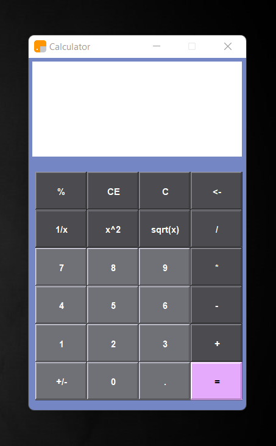

# Java Swing Calculator


This is a simple calculator application developed using Java Swing. It provides basic arithmetic operations such as addition, subtraction, multiplication, and division. The calculator offers a user-friendly graphical interface for performing mathematical calculations.

[](https://www.oracle.com/java/technologies/)
[](https://docs.oracle.com/javase/8/docs/api/javax/swing/package-summary.html)

## Table of Contents

- [Features](#features)
- [How to Use](#how-to-use)
- [Contributing](#contributing)
- [License](#license)
- [Acknowledgments](#acknowledgments)
- [Download](#download)

---
## Screenshot
  - User Interface of  Calculator

 
---
## Features

- Addition (+)
- Subtraction (-)
- Multiplication (*)
- Division (/)
- Percentage (%)
- Square Root (sqrt(x))
- Square (x^2)

---
## How to Use

1. Clone this repository to your local machine using `git clone`.

   ```bash
   git clone https://github.com/Harish-Kushwah/SwingCalculator

2.  Open the project in your favorite Java IDE (Eclipse, IntelliJ IDEA, etc.).
  
3.  Run the Calculator.java file to start the calculator application.

4.  Use the graphical user interface to input numbers and perform calculations.

---

## Download
- This calculator is desktop application
- Before downloading the application make sure to set up the JDK17 in computer
- Download  executable file [ click here ](ApplicationFile/SwingCalculator.exe)
- Run the SwingCalculator.exe to use calculator file

---
## Contributing
  If you'd like to contribute to this project, please fork the repository and create a pull request. We welcome contributions that enhance the functionality, improve the user interface, or fix any issues.

---
## License
 This calculator application is open-source and available under the MIT License.

---

## Acknowledgments
This project was inspired by a desire to create a simple, yet functional calculator using Java Swing. Special thanks to the Java Swing community for valuable resources and tutorials.

